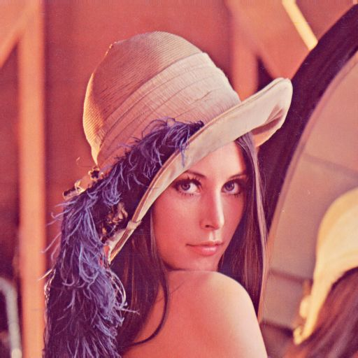

# プログラミング応用 信号処理技術レポート
## 学籍番号：01234567

## 名前：名工 大

## 使用計算機環境情報
* CPU: [Intel Core i7 8650U 1.9GHz （ターボブースト4.2GHz） 4コア8スレッド](https://en.wikichip.org/wiki/intel/core_i7/i7-8650u)
* メモリ: 16GB
* OS: Windows 10 with Windows Subsystem for Linux (WSL1)
* コンパイラ: gcc

CPUの詳細情報は以下等で調べてください．
https://en.wikichip.org/wiki/WikiChip

CSEを使用する場合はその旨を記述し省略可

# 画像処理課題
## imagemagick で様々な画像処理を実行せよ．
imagemagickを使って画像をセピアカラーに変換した．
コマンドは下記である
```bash
convert lena.png out tone 100% out.png
convert -rotate 45 lena_noiseless.png out1.png
convert lena_noiseless.png -threshold 30% out2.png
convert lena_noiseless.png -canny 0x1+5%+20% out3.png
convert -modulate 120 150 50 lena_noiseless.png out4.png
```
また，入出力は下記となった．




図：（左）入力画像，（右）セピア化画像

**そのほかいくつかやってみること．**

## image/lena.ppm の 画像中 の インパルス雑音を消せ．
メディアンフィルタを使ってインパルス雑音を消した.
コマンドは下記である
```bash
convert -median 5 lena.ppm out.png
```


図：（左）入力画像，（右）メディアンフィルタを使った画像

見た感じでは、フィルタの半径を5以上にするとインパルス雑音が完全に消えた。

# レベル１
レベル１の課題を，コンパイルオプションや実行オプションを変えながら，下記コマンドで実行時間の計測と動作のチェックを行った．
（冒頭には何をやったかを端的に書いてください．）

```bash
time sh run.sh level1
sh answer.sh result level1
```

Makefileのコンパイルやスクリプト内のmatchingのコマンドライン下記のように複数の組み合わせで変更した．表１に結果を示す．
1. 全てデフォルト
2. コンパイルオプション-O1, 引数がデフォルトのcp
3. コンパイルオプション-O1, 引数がcpg(グレイスケールを使う)．
4. コンパイルオプション-O2, 引数がcpg．
5. コンパイルオプション-O3, 引数がcpg．
6. コンパイルオプション-0fast, 引数がcpg．


表１：各コンパイルオプションとコマンドライン引数による実行時間

|オプション|引数|時間|
|-------|---|----|
|デフォルト|cp|xx s|
|-O1   |cp |1m14.446s|
|-O1   |cpg|0m40.878s|
|-O2   |cpg|0m39.939s|
|-O3   |cpg|0m5.740s|
|-Ofast|cpg|0m5.875s|


なお，すべての場合で正答率は100％であった．


考察：カラーよりもグレイ画像の方が実行時間が短い。-01~-03は数字が大きいほど速い。-0fastよりも-03の方が速い。考察を書く．事実と意見は分けて書くために，結果と考察は分けて書くこと．

# レベル２
レベル２に対応するために`run.sh`において,事前の画像処理にimagemagickによるメディアフィルタを入れた．
```bash
convert -median 3 "${image}" "${name}"
```

閾値は0.5のままにした。
実行時間：0m8.211s
また，全体的に高速化するためにｘｘｘの変更を行った．この変更は以下のレベルすべて共通で用いている．


Ａの変更をした場合，Ｂの変更した場合それぞれの実行時間と正答率を表ｘｘｘおよび表ＹＹＹに示す．

考察：ＡはｘｘでＢはＸＸであった．


# レベル３
レベル3に対応するために`run.sh`において,事前の画像処理にmagemagickによるコントラスト強調を入れた．

```bash
convert -equalize "${image}" "${name}"
```

閾値は0.7にした。
0m5.868s
（これはレポート用に適当に書いただけで，レベル３に効果がある保証は全くないです）．
ソースコードはこのようにはりつけられます．
できるだけ該当箇所を抜粋して．
```c
//SSD
for (j = 0; j < template->height; j++)
{
	for (i = 0; i < template->width; i++)
	{
		int v = (src->data[(y + j)*src->width + (x + i)] - template->data[j*template->width + i]);
		distance += abs(v);//ここを変更した．元はdistance += v*v;
	}
}

```

# レベル４

レベル４に対応するために`run.sh`において，事前の画像処理にヒストグラム平坦化を入れた．


（実際は効果があるかは知りません．）

```c
for (y = 0; y < (src->height - template->height); y++)
    {
        for (x = 0; x < src->width - template->width; x++)
        {
            int distance = 0;
            // SSD
            for (j = 0; j < template->height; j++)
            {
                for (i = 0; i < template->width; i++)
                {
                    if (template->data[j * template->width + i] == 0)
                        continue; // テンプレートが黒ならスキップ
                    int v = (src->data[(y + j) * src->width + (x + i)] -
                             template->data[j * template->width + i]);
                    distance += v * v;
                }
            }
            if (distance < min_distance)
            {
                min_distance = distance;
                ret_x = x;
                ret_y = y;
            }
        }
    }
```
# レベル５

高速な画像処理ライブラリであるOpenCVを使用するために，すべてをPythonで書き直した．
以下に書き直したPythonコードを示す．

ほぼジョークの類ですが，全部書き直してもいいです．制限は何もありません．
画像を加工してもできそうだけどテンプレートを加工した方が速い
```sh
for image in $1/test/*.ppm; do
    echo `basename ${image}`
    
    x=0    	#
    for i in 50 100 200; do
        echo $i%
        for template in $1/*.ppm; do
        bname=`basename ${template}`
        name="imgproc/"$bname
        echo $name
        convert -resize $i% "${template}" "${name}"  # 拡大縮小
        rotation=0
        echo $bname:
        if [ $x = 0 ]
        then
            ./matching "${image}" $name $rotation 0.5 cpg 
            x=1
        else
            ./matching "${image}" $name $rotation 0.5 pg 
        fi
        done
        echo ""
    done
done
wait
```
# レベル６
```sh
for image in $1/test/*.ppm; do
    echo `basename ${image}`
    
    x=0    	#
    for i in 0 90 180 270; do
        echo $i°
        for template in $1/*.ppm; do
        bname=`basename ${template}`
        name="imgproc/"$bname
        echo $name
        convert -rotate $i% "${template}" "${name}"  # 回転
        rotation=0
        echo $bname:
        if [ $x = 0 ]
        then
            ./matching "${image}" $name $rotation 0.5 cpg 
            x=1
        else
            ./matching "${image}" $name $rotation 0.5 pg 
        fi
        done
        echo ""
    done
done
wait
```
# レベル７

# FINAL
最終テストの結果を示す．
ｘｘｘ
